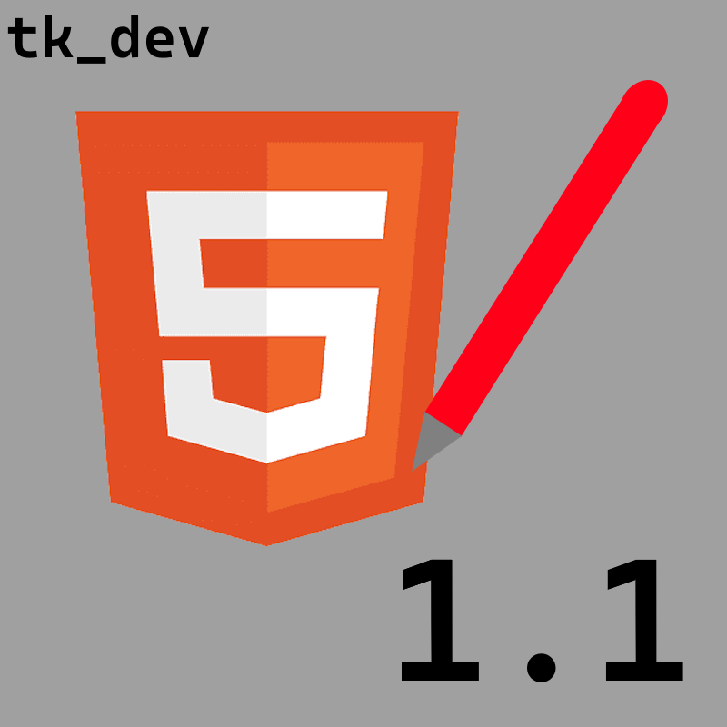
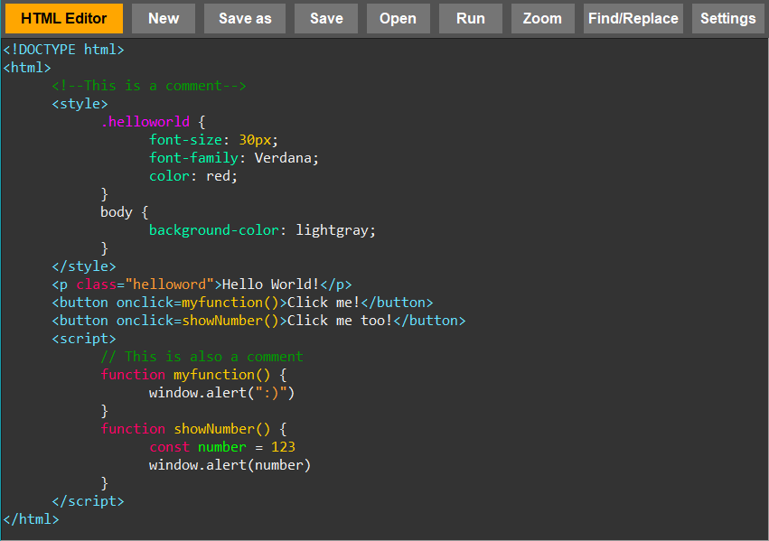
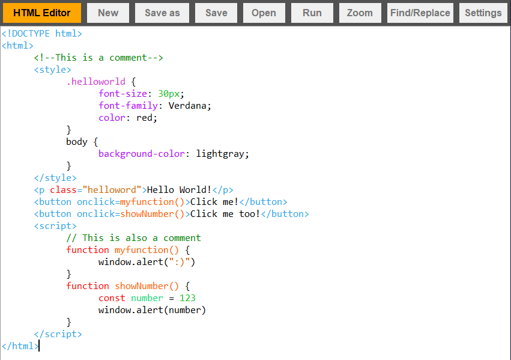
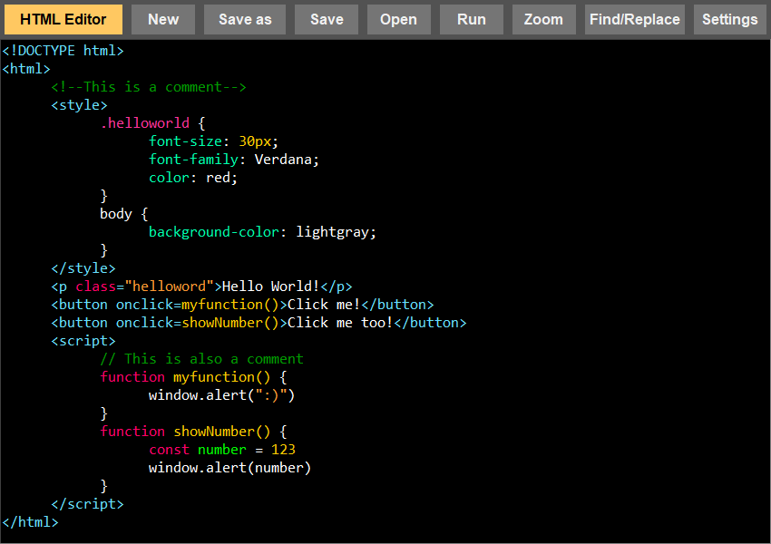
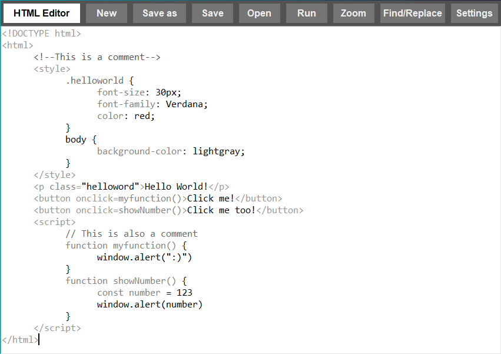

# HTML Editor



This is my HTML, CSS, JavaScript and Markdown editor written in Python. Even though it uses just one external library (Pillow for icons), it has some functions like syntax highlighting and tag completition for HTML, CSS, JavaScript and Markdown code, an autosave function and a function to run the code with one click directly in the program.

## Why use this editor?

This editor serves as an excellent resource for web developers planning to write and execute their code within their Python environment.
It is also an ideal learning platform for beginners eager to learn coding, as the editor is straightforward and user-friendly.

Additionally, the editor allows for easy configuration by altering the Python code.
If you wish to make changes or add new features, you can simply modify the Python files.

## Starting with the editor

### Installation

1. Install Python 3.x
2. Install the pillow library with ```pip install pillow``` (You can skip this if you don't need icons)

### Running

Run the program with ```python 3.x```

- Run the ```.py``` file for console access
- Run the ```.pyw``` file for no console

### Building .exe / .dmg

The developer has chosen not to include an .exe or .dmg file to the repository.
This is because of issues with antivirus software which sometimes falsely 
detects malware in the pyInstaller bootloader.

If you want to build an exe yourself, do the following:

0. Download the latest release (And the Pillow library, assuming you are not building an .exe file because you cannot install Python.)
1. Download auto_py_to_exe (Pyinstaller with GUI) with ```py -m pip install auto_py_to_exe```
2. Run the following command in the terminal: ```py -m auto_py_to_exe```
3. Set up pyinstaller as following:
    - Set ```main.py``` or ```main.pyw``` as ```path to file```
    - Make sure ```Onefile``` is set to ```one directory```
    - Set ```Console window``` to ```Window based```
    - Set ```Icon``` to the icon from ```internal/icons/favicon.ico``` (Optional)
4. Convert .py to .exe
5. Copy the ```internal``` folder from the repo into the output folder the .exe is located
6. Run the .exe

If you run into any problems, feel free to contact the developer at any time!
Sadly, as I don't have enough experiency with pyinstaller on macOS to give detailed instructions,
but pyinstaller *should* work with the python files from the ```macOS``` folder.

## Using the editor

In the main window, start writing your code. The editor will mark keywords, variables, functions and more.
**Note: The editor does not mark errors in the code (yet).**

### Menu Bar

In the menu bar, you will find the following buttons:

- HTML Editor (This opens an about window with informations about the program)
- New (This opens a new window with a new file)
- Save as (This saves the current document to a specified file path)
- Save (This saves changes to the document; will prompt for a file path if the file was not saved previously)
- Open (This opens a file from your computer)
- Run (This runs the current document in the default browser)
- Zoom (Changes the text size)
- Find/Replace (Finds a given string in the text and replaces it if another string is given)
- Settings (Opens the settings window)

### Syntax Highlighting

The editor uses Python regular expressions to highlight HTML, CSS and JavaScript tags, keywords, variables, strings, integers, functions and comments. As the highlighting engine is improved constantly, support for other languages is coming soon.

### Auto Save

If activated the editor will automatically save your changes every 10 seconds until disabled by clicking the button again. You can change the interval in line 547:

```python
def auto_save(self):
        """Saves the current document automatically at regular intervals"""
        self.save_changes()
        self.root.after(
            10000, self.auto_save # <-- Here
        )
```

### Tag auto completition

The editor will auto complete HTML tags and strings if you start typing them in the editor. This feature can be turned off in settings.

### Appearance

In the settings, you can switch between 4 themes:

1. Dark mode (Default)

2. Light mode

3. High contrast mode

4. Black/White Mode


## Additional information

For more information, please see ```docs/guide.html```

Written by Tobias Kisling

Version 1.1

This software is released under the MIT-License. For more information please see the ```license.md```!

You can reach me by mail (<tobias.kisling@icloud.com>) or on github (<https://github.com/hasderhi>).

# tk_dev - Software with passion!
